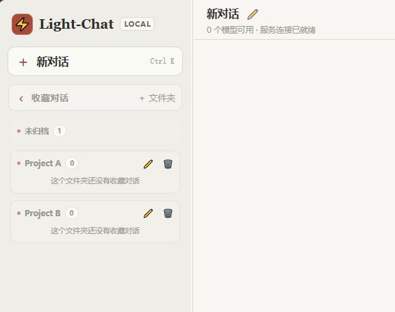
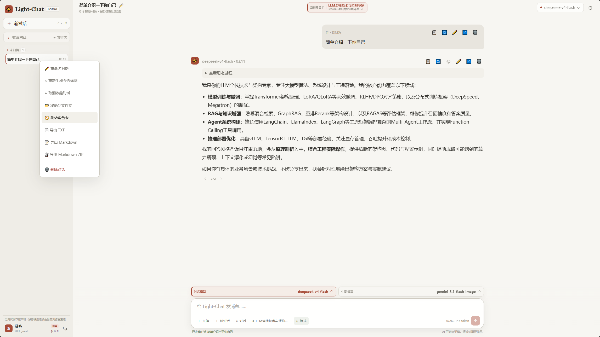
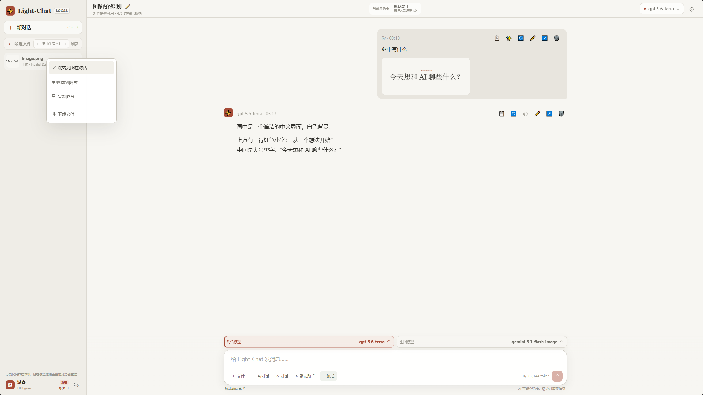
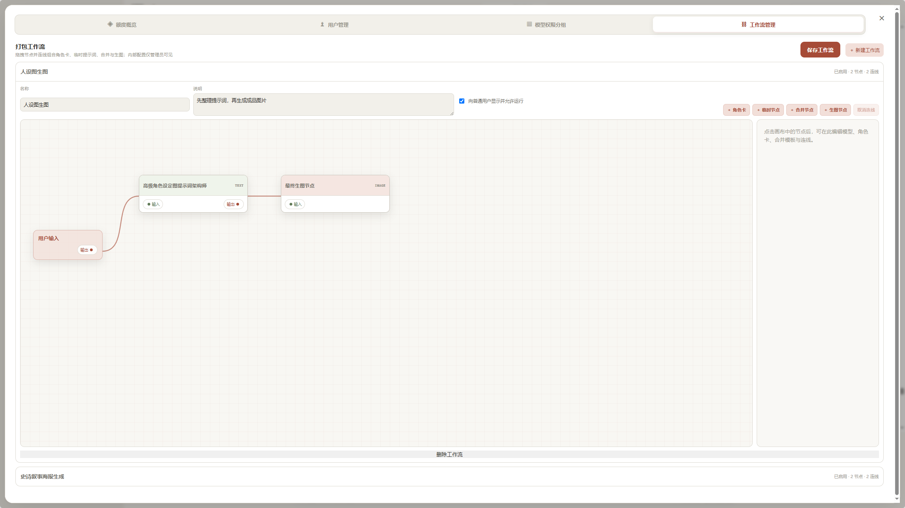
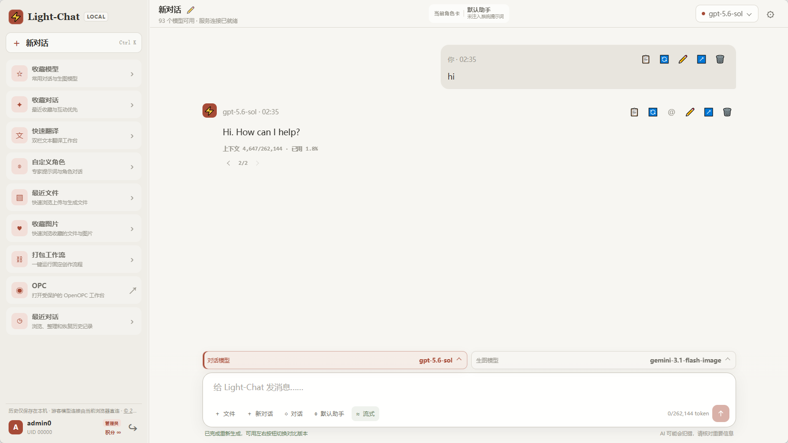
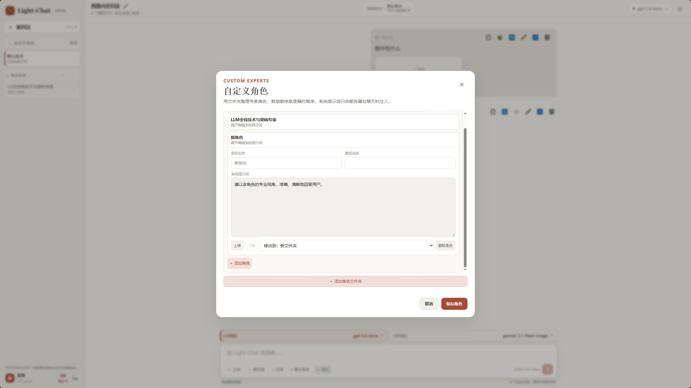
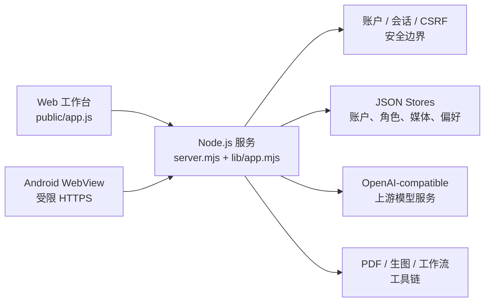

# Light-Chat

[](LICENSE)

Light-Chat 是一个运行在本机、面向多用户的 AI 聊天工作台。管理员负责创建用户、分配积分和模型权限，普通用户专注对话与知识整理。服务端代持上游 API 密钥，密钥不会进入浏览器；普通用户会话正文保存在浏览器本地，服务端不收集聊天内容。

它不是又一个只能打开单一模型页面、发送几条消息的聊天界面。Light-Chat 把多模型对话、生图与图片编辑、可整理的对话历史、可复用角色和多步骤工作流放进同一个工作台；多人使用时，管理员还能统一管理模型权限与额度，并按账户隔离用户数据。

使用它可以直接得到这些体验：

- **不用在不同模型页面之间来回切换**：在同一个对话里选择对话模型、生图模型或图片编辑模型。
- **让对话变成可继续使用的工作资料**：文件夹、收藏、分支、回答版本和导出都围绕历史对话组织。
- **把重复任务变成可复用流程**：角色卡保存稳定的工作方式，多步骤工作流串联角色、提示词、合并和生图节点。
- **让图文资料直接进入工作台**：图片、PDF、Word 和 PowerPoint 可以作为对话材料，生成的图片也能统一预览、收藏和回溯。
- **换设备也能继续工作**：管理员登录其他设备后，可以从服务端恢复完整会话、图片和工作资料，不必依赖某一台浏览器；普通用户和游客的聊天正文为了隐私只保存在本地，不提供跨设备同步。

项目同时提供 Web 工作台和受限 HTTPS Android 客户端。

## 项目定位

许多 AI 聊天工具解决的是“发出一条消息并拿到回答”，但真实工作还包括选择合适的模型、保留资料上下文、反复修订结果、复用角色和把多步任务交给别人继续运行。Light-Chat 的设计目标，是把这些容易割裂的动作收敛到同一个工作台，同时明确区分服务端账户数据、浏览器本地历史和游客直连配置的边界。

## 界面预览


Light-Chat 新对话主界面：在一个工作区内选择模型、角色和工作流，整理历史对话与媒体，并直接开始多模态任务。

## 核心亮点与设计动机

### 1. 对话文件夹

<ins><em>把零散的对话按项目或主题收拢，下一次继续工作时，不必在一长串标题里翻找上下文。</em></ins>

**设计动机：** 聊天记录一旦积累，真正的成本不在“再开一个对话”，而在重新找到某次资料整理、方案讨论或论文解读。只按时间排列会让同一项目的上下文被后续闲聊冲散，也会让用户不敢保留有价值的历史。

**具体实现：** 历史对话支持创建文件夹、拖拽归组、折叠展开和文件夹头部管理；未归档对话保持独立折叠区。文件夹结构会在当前浏览器持久化，对话按最近活动排序，方便把会话逐渐整理成可继续使用的工作资料。

<p align="center">
  
</p>

### 2. 收藏对话与角色回溯

<ins><em>把正在推进的关键会话固定下来，并一键回到它所使用的角色卡和同类工作记录。</em></ins>

**设计动机：** 文件夹解决“放在哪里”，但解决不了“眼下最重要的是哪几段对话”。而当一个角色承担长期任务时，用户还需要从某段收藏对话回看角色定义与它产出的其他会话，避免把角色设定、讨论记录和后续分支割裂开。

**具体实现：** 常用会话可以一键收藏，并按最近活动自动排序。收藏对话的右键菜单支持继续上下文、从历史消息建立新对话，以及直接**跳回对应的自定义角色界面**，展开该角色的其他历史对话。

<p align="center">
  
</p>

同一张右键菜单截图同时展示“收藏对话”和“跳转角色卡”：选择“跳转角色卡”即可打开关联的自定义角色并浏览该角色的其他历史对话。

### 3. 收藏图片与源消息回溯

<ins><em>收藏一张图片后，仍能回到当时的提示词、模型和完整讨论，而不是只留下脱离语境的文件。</em></ins>

**设计动机：** 生图结果、图像分析和上传附件很容易在历史里失去来处。单纯的下载目录无法回答“这张图是怎样生成的”“它对应哪一轮讨论”，也不适合在多个项目间筛选真正要复用的素材。

**具体实现：** 生成过的图片会进入按用户隔离的媒体库，支持跨页浏览、灯箱预览、悬浮下载、上下文菜单复制，以及**从图片跳回源消息**。在图片卡片或灯箱中右键，可以选择跳转到所在对话、取消收藏、复制图片或下载文件；服务端按 UID 校验图片归属，用户之间无法互相读取。

<p align="center">
  
</p>

### 4. 本地图片超分

<ins><em>需要增强画面细节时用 AI 超分；需要保留文字、线条和排版时，避免 AI 重绘带来的失真。</em></ins>

**设计动机：** “统一使用 AI 放大”看似简单，却会让带文字的研究图、界面截图和排版图片出现错字或变形；反过来，只做传统缩放又无法补足插画、照片类素材的细节。因此这里需要让用户按图片内容选择，而不是把一种算法强加给所有图。

**具体实现：** **细节增强**调用 Real-ESRGAN NCNN Vulkan 的 `realesrgan-x4plus`，再用 Pillow 调整到目标尺寸；**文字保真**跳过 AI 超分，仅使用 Pillow 的高质量 `LANCZOS` 缩放。部署细节增强需准备 Python、Pillow、`realesrgan-ncnn-vulkan.exe` 与模型文件；默认引擎路径为项目同级的 `../image-upscaler/realesrgan-ncnn-vulkan/realesrgan-ncnn-vulkan.exe`。未配置本地超分时，聊天、生图和图片编辑仍可独立使用。

### 5. 收藏模型组

<ins><em>面对几十个上游候选模型时，只把真正常用的对话与生图模型放到手边，不必修改服务端模型目录。</em></ins>

**设计动机：** API 渠道和自建网关经常暴露大量模型。完整列表有利于管理员管理权限，却会让日常对话里的选择器变成噪声；为了简化选择而删掉服务端模型，又会误伤其他用户或后续试验。

**具体实现：** 收藏模型把个人常用模型整理为分组，分别用于对话与生图选择器；右上角模型按钮优先展示收藏，底部“更多模型”仍可进入完整模型库。收藏不会改动上游可用模型列表，服务端继续按“权限组 + 额外模型”过滤，因此普通用户只会看到并使用被授权的模型。

<p align="center">
  
</p>

### 6. 浏览器直连的游客模式

<ins><em>不创建账户、不把自己的 API 密钥交给本站，也能在当前设备接入一个自己可访问的 OpenAI 兼容端点。</em></ins>

**设计动机：** 演示和临时使用不应强迫用户注册；更重要的是，用户设备本地可访问的模型服务未必能从部署 Light-Chat 的服务器访问。如果游客密钥先上传到本站再转发，隐私边界和产品承诺都会变得模糊。

**具体实现：** 登录页支持免密进入游客模式。游客默认没有积分、也没有系统预置模型权限，但可在设置中配置 OpenAI 兼容端点、可选 API 密钥和模型列表。配置仅保存在当前浏览器，模型列表、对话和生图请求由浏览器直接发往上游；因此上游需要允许浏览器跨域请求。

想快速体验游客模式，可以直接访问 [chat.brightcl.top](https://chat.brightcl.top)，在登录页选择“以游客身份进入”。

### 7. 不打断对话的快速翻译

<ins><em>阅读资料时随手完成双栏翻译，不必离开正在进行的对话，也不必把译文混进工作上下文。</em></ins>

**设计动机：** 翻译往往是阅读论文、接口文档或外部资料时的短任务。若把原文直接发送进当前对话，会污染上下文、影响后续回答；切去另一项工具又会打断资料阅读的节奏。

**具体实现：** 内置独立的双面板翻译工作台：左侧输入原文、右侧保留译文，翻译历史仅存于本地浏览器，并可选择当前已授权模型。翻译请求使用隔离的受保护提示词，不会改写或占用当前聊天会话。

### 8. 可打包、可审查的工作流

<ins><em>把论文解析、RAG 证据整理或研究笔记生成固定为一条可重复运行的流程，而不是靠人每次重新拼提示词。</em></ins>

**设计动机：** 复杂任务往往不止一次模型调用：先用角色卡确定方法，再做临时整理或合并，最后才生成图片或输出。将这类步骤写成一段超长提示词难以审查、难以复用，也无法明确知道哪个环节负责什么。

**具体实现：** 工作流画布以“用户输入”为起点，支持角色卡、临时系统提示词、合并与最终生图节点，并用连线表达数据流。管理员可以拖拽节点、编辑参数和保存流程；普通用户仅运行已启用工作流。服务端执行时只注入已校验的角色或系统提示词，避免客户端直接提交任意 system 消息。

<p align="center">
  
</p>

管理员工作流画布：从“用户输入”开始，经由提示词架构师节点，连线到最终生图节点；右侧检查器用于编辑节点参数和连接关系。

### 9. 可编辑、可分支的历史消息

<ins><em>发现某一轮提问写错、模型选错或回答不满意时，从那一处修正和探索，不用牺牲后面的工作记录。</em></ins>

**设计动机：** 对话不是一次性的聊天记录，而是不断修订的工作过程。传统“删除重来”会丢掉后续上下文；只提供重新生成又不能比较模型差异。用户需要在同一条历史上保留不同尝试，同时保持每个尝试的来龙去脉。

**具体实现：** 输入框支持 `Enter` 发送、`Shift + Enter` 换行；消息悬停后可复制、重新生成、编辑、建立分支或单条删除。助手消息支持用 `@` 收藏模型生成新版本，并可切换最多 8 个回答版本；每个版本保留对应的后续消息链、模型名、图片、思考过程和 usage。

<p align="center">
  
</p>

真实对话界面示例：用户消息与助手回答旁直接显示复制、重新生成、编辑、分支和删除等操作按钮，底部输入框保持同一套发送工作流。

### 10. 可复用且受控的自定义角色

<ins><em>把稳定的专业工作方式沉淀成角色卡，并在复用时保持系统提示词的服务端安全边界。</em></ins>

**设计动机：** 很多任务需要长期维持同一套角色要求，例如论文解析、RAG 架构评审或工程方案梳理。反复粘贴系统提示词既容易漂移，也让用户无法分辨“本次回答到底用了哪套规则”；若允许客户端任意提交 system 消息，又会绕过角色库的权限和审计边界。

**具体实现：** 自定义角色支持文件夹、拖拽排序、右键管理，以及展开查看并跳转到该角色衍生的对话。对已登录账户，系统提示词只保存在服务端；聊天请求按角色 ID 解析并注入，客户端不能绕过校验提交任意 system 消息。游客角色则仅保存在当前浏览器，符合游客直连模式的本地边界。

<p align="center">
  
</p>

## 配套能力与设计动机

- **多模型对话：** 同一任务可能需要低延迟模型、长上下文模型或具备视觉能力的模型；默认 SSE 流式、可切换单次 JSON，并保留多轮上下文、附件与 usage，让选择模型真正服务于任务，而不是把用户锁在单一上游。
- **生图与图片编辑：** 生成、参考图编辑和文本对话经常出现在同一条工作链里；系统根据上游模型能力提供生图或编辑入口，并把结果纳入对话和媒体库，避免在聊天工具与图片工具之间来回搬运文件。
- **文档上传：** 论文、会议记录和方案通常已经存在于 PNG/JPEG/WebP、TXT/MD、PDF、DOC/DOCX、PPT/PPTX 中；服务端先做签名与体积校验，再把附件交给对应流程，减少“先手工提取文字、再粘贴到聊天框”的重复劳动。
- **账户与额度管理：** 多人共用上游时，模型权限、积分和审计不能只靠前端约定；账户中心提供额度概览、用户管理、充值/启停/删除和模型权限分组，把资源分配与日常对话分开管理。
- **Android WebView 客户端：** 移动端需要更明确的网络与凭据边界；客户端使用受限 HTTPS 和 HttpOnly Cookie 持久登录，不保存密码或密钥，复用 Web 工作台能力而不复制一套业务状态。

## 架构概览



普通账户的请求、权限和上游模型调用经过 Node 服务端；游客模式由浏览器直连用户配置的上游，浏览器不把游客密钥提交给本站。`lib/` 负责领域逻辑，`public/` 提供无构建前端，`android/` 是面向移动端的受限客户端。

## 界面示例

<p align="center">
  
</p>

游客模型直连设置：端点和密钥只保存在当前浏览器，模型列表、对话和生图请求由浏览器直接发送到用户配置的上游服务。

## 安全设计

- 服务仅监听 `127.0.0.1`，外网入口通过 HTTPS 反向代理。
- 密码使用 `scrypt` + 独立随机盐保存，永不保存明文。
- 会话为服务端不透明令牌，CSRF、同源校验、登录限速、UID 数据隔离默认开启。
- 管理员关键操作写入 `.data/admin-audit.jsonl`，不记录密码、密钥或请求正文。
- 游客免密会话只获得零积分、零预置模型权限的浏览器本地角色；游客端点和 API 密钥只保存在当前浏览器缓存，不写入本站服务端。
- 普通账户上游 API 地址由服务端配置；游客模式由浏览器使用用户在本机设置的端点直连，不限定于任何特定 API 渠道。

## 快速开始

环境要求：Windows 10/11、Node.js 22+、OpenAI 兼容上游服务（默认地址为 `127.0.0.1:3002`，可通过环境变量修改）。

```powershell
.\scripts\configure-secrets.ps1
.\scripts\start-server.ps1
```

`configure-secrets.ps1` 会交互式配置引导管理员用户名、初始密码和上游 API 密钥，经当前 Windows 用户 DPAPI 加密后写入 `.secrets/`。默认地址为 `http://127.0.0.1:3020`。

后台运行与登录自启动：

```powershell
.\scripts\start-background.ps1 -Port 3020
.\scripts\install-autostart.ps1 -Port 3020
```

## 部署域名

仓库源码不包含个人部署域名。服务端允许的 Host 按以下顺序解析：

1. `-AllowedHosts` 参数
2. 环境变量 `CHAT_ALLOWED_HOSTS`
3. gitignored 的 `.local/allowed-hosts`
4. 默认 `127.0.0.1,localhost`

Android 构建的 Base URL 同样支持 `.local/base-url` 或 `LIGHT_CHAT_BASE_URL`，方便本机一键构建而不把域名提交到仓库。

## 上游 API 配置

上游地址通过 `CHAT_UPSTREAM_BASE_URL` 指定，默认值为 `http://127.0.0.1:3002/v1`。也可以在本机创建 gitignored 的 `.local/upstream-base-url` 写入自定义地址，`scripts/start-server.ps1` 会自动读取。

其他服务端环境变量：

| 变量 | 说明 |
| --- | --- |
| `CHAT_UPSTREAM_API_KEY` | 上游 API 密钥，仅存于服务端进程内存 |
| `CHAT_UPSTREAM_BASE_URL` | 上游 OpenAI 兼容 API 地址 |
| `CHAT_BOOTSTRAP_USERNAME` | 引导管理员用户名 |
| `CHAT_BOOTSTRAP_PASSWORD` | 引导管理员初始密码 |
| `CHAT_SESSION_SECRET` | 会话签名密钥 |
| `CHAT_PORT` | 监听端口，`3020–4000` |
| `CHAT_TRUST_PROXY` | 反代场景置为 `true` |
| `CHAT_ALLOWED_HOSTS` | 允许的 Host，逗号分隔 |
| `CHAT_DATA_DIR` | 运行时数据目录，默认项目内 `.data/` |

## 目录结构

```text
lib/                 服务端逻辑：账户、会话、安全、媒体、上游 API 客户端等
public/              前端静态资源：登录页、工作台、样式、KaTeX 等
scripts/             PowerShell 配置/启动/后台/Android 构建脚本
android/             Android WebView 客户端
test/                Node 单元与集成测试
.data/               运行时数据（gitignored）
.secrets/            DPAPI 加密凭据（gitignored）
```

## 验证

```powershell
npm test
npm run check
```

## 数据与隐私

- `.data/`、`.secrets/`、`.logs/`、`.run/`、`.local/` 等运行时目录均被 `.gitignore` 排除。
- 普通用户聊天正文只存在浏览器 `localStorage`；管理员会话以服务端 `.data/conversations-00000.json` 为准。
- 服务端只保存密码哈希、会话令牌、积分、权限、登录账户数据和管理员媒体索引，不保存游客 API 密钥或游客聊天正文。
- 服务端 JSON 每次保存前会自动保留上一份 `.bak`；收藏图片等偏好记录意外被清空时，可运行 `.\scripts\restore-preferences-backup.ps1` 从备份恢复。

## License

MIT License，详见 [LICENSE](LICENSE)。

## 作者

© 2026 [Bright-Chengliang](https://github.com/Bright-Chengliang) · Light-Chat
